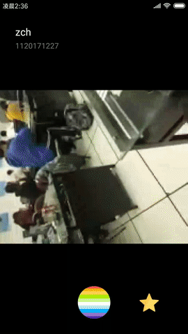
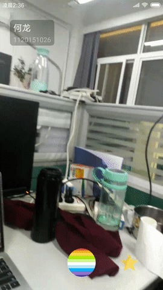

# Siksok

### Feature checklist
#### Home page
- [x] **Pager display**
- [ ] Pulling refresh
- [x] Empty control video player
- [x] **Double click to like and add to favorites**
- [ ] slide the screen to enter favorites page

#### Favorites page
- [x] Display your favorites
- [x] Full screen display
- [x] Deleting supported.

#### Recording page
- [x] Preview the picture
- [x] Click to record, 10s auto-recording is supported.
- [x] **Single finger dragging to zoom in and out**
- [x] Camera switching
- [x] Touch to focus
- [x] Auto uploading after recording
- [ ] Show upload progress
- [x] **Auto extracting frame as cover**

### Key Point
#### 1、Pager display

I used `RecyclerView` + `StaggerLayoutManager` to implement
a UI that can display video feeds in two columns at first. But there was a
problem that sometimes one column showed a bulk blank. With vain attempt to solve this problem, I changed
the design solution. I use `RecyclerView` + `ViewPagerLayoutManager` to implement pager display
that show one fullscreen video in feed at one swipe.

`ViewPagerLayoutManager` uses `PagerSnapHelper` to implement pager display,
and manages video player lifecycle itself.

`LayoutManager.onScrollStateChanged()` is called when the scroll state changes. There are three
types of states:

- `SCROLL_STATE_DRAGGING` In this state, the content in the screen is dragged by the finger.
- `SCROLL_STATE_SETTLING` The RecyclerView is currently animating to a final position while not under outside control.
- `SCROLL_STATE_IDLE` The RecyclerView is not currently scrolling.

*Reference: https://github.com/DingMouRen/LayoutManagerGroup*

`RecyclerView.OnChildAttachStateChangeListener`
- `onChildViewAttachedToWindow()` Called when a view is attached to the RecyclerView.
- `onChildViewDetachedToWindow()` Called when a view is detached from RecyclerView.
Video play should be released in this case.

*Reference: https://developer.android.google.cn/reference/android/support/v7/widget/RecyclerView.OnChildAttachStateChangeListener*

#### 2、Double click on like and add to favorites

In staggered feed view, video covers are displayed in `DoubleClickImageView`,
an extending `AppCompatImageView` to receive double click events.
In pager version, `DoubleClickImageView` is reuse to support double-click like.
A transparent `DoubleClickImageView` covers video player to receive double click events and plays "like" animation.

`GestureDetector.SimpleOnGestureListener` In this class, `onDoubleTap()` is override.
This callback notifies when a double-tap occurs.
`DoubleClickImageView` encapsulates `GestureDetector`, with an outer interface `setOnDoubleClickListener()`.

*Reference: https://developer.android.google.cn/reference/android/view/GestureDetector*

